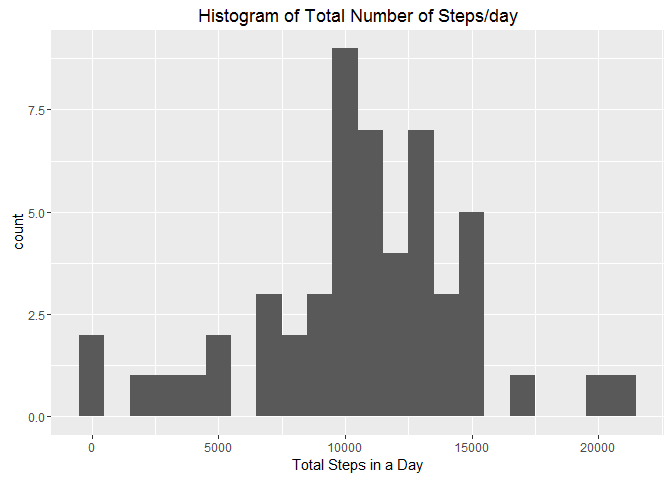

# Reproducible Research: Peer Assessment 1


## Loading and preprocessing the data

```r
library(ggplot2)
library(sqldf)
```

```
## Loading required package: gsubfn
```

```
## Loading required package: proto
```

```
## Loading required package: RSQLite
```

```
## Loading required package: DBI
```

```r
library(mice)
```

```
## Loading required package: Rcpp
```

```
## mice 2.25 2015-11-09
```

```r
setwd("C:\\Coursera\\RepData_PeerAssessment1")
repData <- read.csv(file="activity.csv", header=TRUE,sep=",")
```

## What is mean total number of steps taken per day?

Mean total number of steps taken per day

```r
tsteps <- aggregate(steps ~ date, data=repData, FUN=sum)
summary(tsteps)
```

```
##          date        steps      
##  2012-10-02: 1   Min.   :   41  
##  2012-10-03: 1   1st Qu.: 8841  
##  2012-10-04: 1   Median :10765  
##  2012-10-05: 1   Mean   :10766  
##  2012-10-06: 1   3rd Qu.:13294  
##  2012-10-07: 1   Max.   :21194  
##  (Other)   :47
```
mean is 10766 and median is 10765

A histogram of the total number of steps taken each day


```r
ggplot(tsteps, aes(steps)) + geom_histogram(binwidth=1000, na.rm = FALSE) +
        xlab("Total Steps in a Day") +
        ggtitle("Histogram of Total Number of Steps/day" )
```

<!-- -->

## What is the average daily activity pattern?

Following line graph gives the average daily activity pattern where variation 
of average steps for a particular time interval


```r
tsAvgIntSteps <- sqldf('select interval, avg(steps) AvgSteps from repData group by interval')
```

```
## Loading required package: tcltk
```

```r
ggplot(tsAvgIntSteps, aes(interval, AvgSteps )) + geom_line(colour="red",
        size=1.0, na.rm=FALSE)  + xlab("Interval in mins") +
        ylab("Average Steps") +
        ggtitle("Variation of Average Steps with time interval" )
```

<!-- -->


```r
sqldf('select  interval, max(AvgSteps) from tsAvgIntSteps') 
```

```
##   interval max(AvgSteps)
## 1      835      206.1698
```
Average Steps is maximum for time interval

## Imputing missing values

Analysis of missing values

```r
md.pattern(repData)
```

```
##       date interval steps     
## 15264    1        1     1    0
##  2304    1        1     0    1
##          0        0  2304 2304
```
it shows that 2304 records are having steps missing.

Now impute missing data by using mice package using predictor mean method for filling the missing values.  Then find the mean and median values

```r
tempRepData <- mice(repData,m=1,maxit=50,meth='mean',seed=50)
```

```
## 
##  iter imp variable
##   1   1  steps
##   2   1  steps
##   3   1  steps
##   4   1  steps
##   5   1  steps
##   6   1  steps
##   7   1  steps
##   8   1  steps
##   9   1  steps
##   10   1  steps
##   11   1  steps
##   12   1  steps
##   13   1  steps
##   14   1  steps
##   15   1  steps
##   16   1  steps
##   17   1  steps
##   18   1  steps
##   19   1  steps
##   20   1  steps
##   21   1  steps
##   22   1  steps
##   23   1  steps
##   24   1  steps
##   25   1  steps
##   26   1  steps
##   27   1  steps
##   28   1  steps
##   29   1  steps
##   30   1  steps
##   31   1  steps
##   32   1  steps
##   33   1  steps
##   34   1  steps
##   35   1  steps
##   36   1  steps
##   37   1  steps
##   38   1  steps
##   39   1  steps
##   40   1  steps
##   41   1  steps
##   42   1  steps
##   43   1  steps
##   44   1  steps
##   45   1  steps
##   46   1  steps
##   47   1  steps
##   48   1  steps
##   49   1  steps
##   50   1  steps
```

```r
summary(tempRepData)
```

```
## Multiply imputed data set
## Call:
## mice(data = repData, m = 1, method = "mean", maxit = 50, seed = 50)
## Number of multiple imputations:  1
## Missing cells per column:
##    steps     date interval 
##     2304        0        0 
## Imputation methods:
##    steps     date interval 
##   "mean"   "mean"   "mean" 
## VisitSequence:
## steps 
##     1 
## PredictorMatrix:
##          steps date interval
## steps        0    1        1
## date         0    0        0
## interval     0    0        0
## Random generator seed value:  50
```

```r
completedData <- complete(tempRepData,1)
tstepsMod <- aggregate(steps ~ date, data=completedData, FUN=sum)
summary(tstepsMod)
```

```
##          date        steps      
##  2012-10-01: 1   Min.   :   41  
##  2012-10-02: 1   1st Qu.: 9819  
##  2012-10-03: 1   Median :10766  
##  2012-10-04: 1   Mean   :10766  
##  2012-10-05: 1   3rd Qu.:12811  
##  2012-10-06: 1   Max.   :21194  
##  (Other)   :55
```

```r
ggplot(tstepsMod, aes(steps)) + geom_histogram(binwidth=1000, na.rm = FALSE) +
        xlab("Total Steps in a Day") +
        ggtitle("Histogram of Total Number of Steps/day" )
```

<!-- -->

Mean and median doesn't appear to change much after imputing NA values.  
The Histogram shows a better spread after imputing indicating pronounced max 
number of steps for the intervals which have near max values.

## Are there differences in activity patterns between weekdays and weekends?
Using data frame which has been imputed for further analysis to see the activity
patterns differences between weekdays and weekends. 


```r
completedData$dayType <- as.factor(ifelse(weekdays(as.Date(completedData$date)) %in%
         c("Saturday", "Sunday"), "Weekend", "Weekday"))

tsAvgIntStepsMod <- sqldf('select interval, avg(steps) AvgSteps, dayType 
        from completedData group by interval, dayType')


ggplot(tsAvgIntStepsMod, aes(interval, AvgSteps))+geom_line(color="blue")+ 
        facet_wrap(~dayType, ncol=1) +
        xlab("Interval in mins") +
        ylab("Average Steps") +
        ggtitle("Variation of Average Steps with time interval for weekend 
                and weekdays" )
```

<!-- -->

From the comparison plot we can see that average steps are slightly more for weekends 
when compared to weekdays, however the max average steps(Peak) is lower for weekend. 
